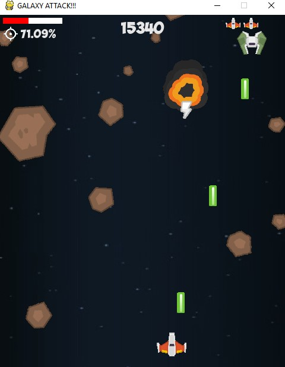
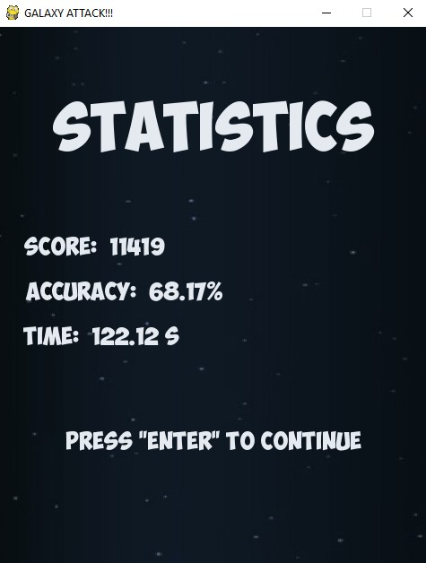

# *Galaxy Attack Game*
-   -   -   
```
Tecnologies stack:
  Python 3
```
### About the game

* To move the player to the right and left, use the "A" and "D" keys respectively. Press the space to shoot.

* Dodge or shoot meteorites, the number of which increases with your score. Also, with a *3%* chance, you can knock out bonuses from meteorites. One of which increases health randomly in the range [10; 30], and the other - activates a laser for 1.5 seconds.

* The player has 3 lives. After death, a screen with statistics appears, on which you can see the game time, the player's accuracy and the points scored.

#### To start the game 
`pip install -r requirments.txt` - *install requirments*

#### Here are a couple of screenshots:




